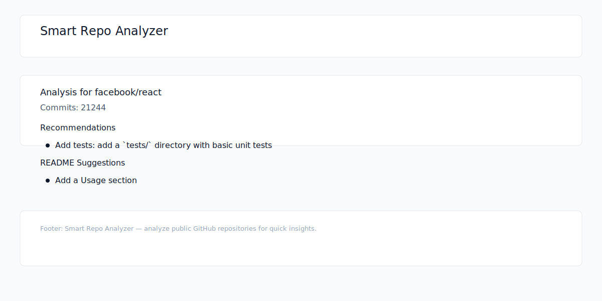

Smart GitHub Repository Analyzer
================================

Analyze any public GitHub repository for code quality, README suggestions, folder structure, and GitHub best-practices recommendations.

This project was created during a hackathon. It demonstrates strong use of GitHub features and GitHub Copilot assistance.

See [docs/COPILOT_USAGE.md](docs/COPILOT_USAGE.md) for details on where Copilot helped.

Quick start
-----------

- Backend: `cd server && npm install && npm run dev`
- Frontend: `cd client && npm install && npm run dev`

Styling
-------

- The client uses Tailwind CSS for styling. Tailwind is imported from `client/src/main.css`. Run `npm install` in the client to ensure Tailwind and PostCSS are installed.

Branches & PRs (suggested)
--------------------------

- Branch name: `feature/<short-description>` (e.g. `feature/readme-analyzer`)
- Commit message: `feat(analyzer): add README suggestions analyzer`
- PR title: `Add README suggestions analyzer`

Judging checklist
-----------------

- **Best use of GitHub**: issues, branches, PRs, commits, workflows
- **Visible use of GitHub Copilot**: see `docs/COPILOT_USAGE.md`
- **Clean code and strong documentation**

Features
--------

- Repository analysis: code quality, README suggestions, folder structure, commits insights
- Lightweight API: `/api/analyze?repo=owner/repo`
- Modern stack: Node.js + Express (server), React + Vite (client)

Automation
----------

- CI: `.github/workflows/ci.yml` runs server tests and client build on pushes and PRs
- PR Analyzer: `.github/workflows/analyze-pr.yml` runs the analyzer on every PR and posts a summary comment

Example API call
----------------

- `curl "http://localhost:4000/api/analyze?repo=facebook/react"`

Demo / Screenshots
------------------

- 
- Add more screenshots or a short demo video to `/assets/` and reference them here to include a visual demo.

How GitHub & Copilot were used
-----------------------------

- Copilot-assisted seed work was created on a clearly-labeled branch `copilot/seed` with commit `chore(copilot): seed analyzer and client components (copilot-assisted)`.
- PRs, issues, and workflows were used to show CI and automation running on the repository.

PR & Commit suggestions
-----------------------

- Branch: `feature/readme-analyzer`
- Commit: `feat(analyzer): add README suggestions analyzer`
- PR: `Add README suggestions analyzer`

Submission checklist
--------------------

- [ ] Public GitHub repo link
- [ ] README describing idea, features, how GitHub and Copilot were used
- [ ] Commit history and PRs demonstrating branching and contributions
- [ ] Optional demo screenshots or short video

*** End Patch
